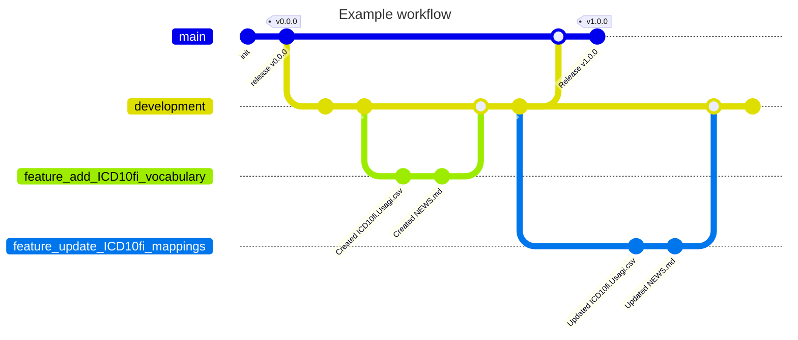

# Repository rules and nomenclatures

## Repo strategy 

Repo branch strategy is similar to gitflow strategy. 
There is one main branch, one development branch, and multiple feature branches. 

- main-branch: host the vocabulary version in use. FinnOMOP members agree periodically to sync to the same version. 
- development-branch: host the latest working vocabulary. 
- feature branches: Every time an update is made, a feature branch is created from development-branch.
 

#### Adding features

The first step to add a feature (where feature means any addition or change to the repository) is to create an issue in GitHub. 
Explain in the issue the feature you want to add and why. Set the correct label to the issue (e.g. `adding_new_vocabulary`, `updating_vocabulary`, etc). 

Secondly, create a new branch starting with the issue id with source branch `development`. 
This can be done directly in Github from the right side menu.   

Now you can pull this branch to your local machine and work on the changes. Try to create commits along the way grouping the changes on the different steps you make.   

When changes in the feature branch are ready, you should create a pull request to the development branch. The repo maintainer will evaluate that the changes are correct and if so they will be merged to the development branch. Some rules for a pull request to be accepted are: 

- The feature branch bring changes only to the files with in the context of the branch. For example, a feature branch named `3-updating-vocab-ICD10fi` must only contain changes in the files related to the ICD10fi vocabulary.  
- If changes in the vocabulary files have been made, the branch must have successfully pass the automatic evaluation tests, and produce a new status dashboard reflecting the changes. 

#### Releases

Timely, the FinOMOP group decides to create a new release. Then development branch is merged to the main branch and a new release is created. FinOMOP member will update their databases to the new release. 

## Repo versioning (DRAFT)

Version refer to the whole repository. 

`v<major>.<minor>.`

- major: Change break backward compatibility: e.g.:
  - Athena vocabulary is updated
  - CDM version is updated
  - Usagi to OMOP process is updated (e.g supporting ancestor table)  
- minor: Change keep backward compatibility:  e.g.:
  - Local vocabularies are added or updated. 
- update: Minor and cosmetic fixes:  e.g.:
  - Documentation is updated
  - A sub change is made in one of the vocabularies

Any change in the repo version must be registered in the [NEWS.md](../NEWS.md) file. 

## Vocabulary versioning (DRAFT)

`v<major>.<minor>.`

- major: Changes break backward compatibility: e.g.:
  - A major change in repo defined above
  - Existing codes are changed
- minor: Changes keep backward compatibility: e.g.:
  - New codes are added
- update: Minor and cosmetic fixes. 
  - Names, translations are updated

Any change in a vocabulary version must be registered in the vocabulary's `NEWS.md` file.

## Concept_id nomenclature 

Each unique code in each vocabulary must have a unique `concept_id`.
OMOP vocabulary allows to create new codes if their  `concept_id` is over the 2 billion. 

We name local codes as follow: `2xxxxyyyyy` where `xxxx` is an identifier for the vocabulary and `yyyyy` is an identifier for the code with in the vocabulary. However, the first 100 codes  in `yyyyy` are reserved for the `vocabulary_id` and `concept_class_id`s. 

For example: 
> ICD10fi vocabulary `xxxx` code is 20010 as defined in [VOCABULARIES/vocabularies_info.csv](../VOCABULARIES/vocabularies_info.csv). 
>
> `concept_id` for the `vocabulary_id` is 2001000001 and `concept_id`s for `concept_class_id`s are from 2001000002 to 2001000099 as defined in [VOCABULARIES/ICD10fi/ICD10fi.info.csv](../VOCABULARIES/ICD10fi/ICD10fi.info.csv)
>
> `concept_id` for the codes are from 2001000100 to 2001099999, as defined in  [VOCABULARIES/ICD10fi/ICD10fi.usagi.csv](../VOCABULARIES/ICD10fi/ICD10fi.usagi.csv)
